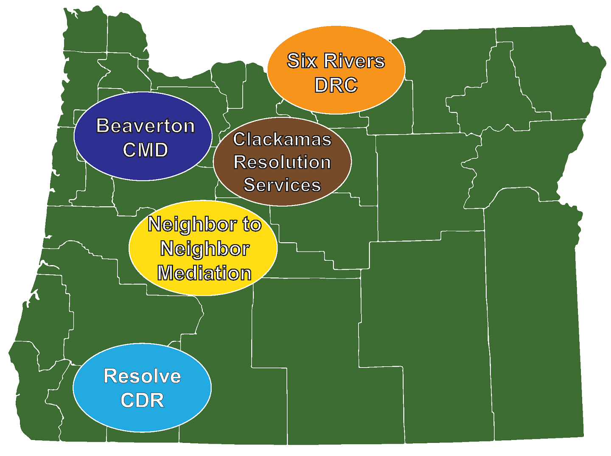

to be translated

## Free Mediation Services to Resolve Renter and Housing Provider Disputes

Prevent an eviction before it's filed.

Resolution Centers in 5 regions across Oregon are now offering free mediation
and conflict coaching for disputes between renters and housing providers. An
eviction does not need to be filed, or even formally talked about, to receive
these services.

As part of an integrated system of services that support housing stability,
mediation is an effective community tool that prevents evictions from being
filed, diverts evictions out of the court system, and keeps people housed.
Our aim is to improve relationships between housing providers and renters so
that eviction filings, and the resulting negative impacts to families and
communities, don't happen in the first place.

Funded by Oregon Housing and Community Services (OHCS) and in partnership
with Resolution Oregon, the program seeks to increase underserved community
member's access to preventative services and to improve access to justice in
Ore<F29><F28>gon.

For more depth on Oregon's Eviction Prevention programs, visit
the [OOCDR's website](https://law.uoregon.edu/academics/centers/adr/oocdr/eviction_prevention_mediation_demonstration).

- [Beaverton Center for Mediation and Dialogue](https://www.beavertonoregon.gov/425/Center-for-Mediation-Dialogue) (Washington County)
- [Clackamas County Resolution Services](https://www.clackamas.us/ccrs) (Clackamas County)
- [Neighbor-2-Neighbor](http://www.n2nmediation.org/) (Marion, Linn, Benton, and Lincoln counties)
- [Six Rivers Dispute Resolution Center](http://www.6rivers.org/) (Hood River, Wasco, Sherman, Gilliam, and Wheeler counties)
- [Resolve](https://resolvecenter.org/) (Jackson and Josephine counties)
